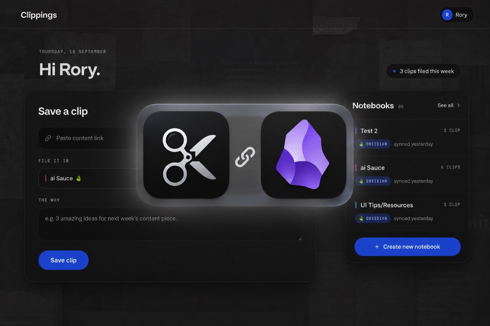
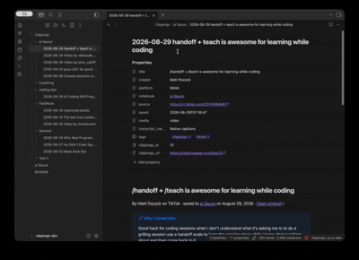

# Clippings Official 🎬

The official [Clippings](https://clippingsapp.xyz/?utm_source=obsidian&utm_medium=plugin&utm_campaign=readme) plugin, maintained by the Clippings team.

Lets you automatically sync every clip you save with Clippings to your Obsidian vault, including the full transcript, AI takeaways and your own notes.

**Exclusive offer for Obsidian users: 10% off your first month or year of any Clippings plan with the code `OBSIDIAN10` at checkout.**



## About Clippings

[Clippings](https://clippingsapp.xyz/?utm_source=obsidian&utm_medium=plugin&utm_campaign=readme) turns the short videos you save into notes you can actually use. Share a TikTok, Instagram Reel, YouTube Short, X post or Facebook video to Clippings and it transcribes the video, pulls out the key takeaways, and files it in a notebook. Photo carousels work too: the text on every slide is read and saved.

Your clips can then flow into the tools you already think in: Obsidian, Notion and NotebookLM. This plugin is the Obsidian half of that.

[Get started for free](https://clippingsapp.xyz/login?signup=1&utm_source=obsidian&utm_medium=plugin&utm_campaign=readme)

## Plugin features

- Every clip you save arrives in your vault as a Markdown note, including:
  - The full transcript (or the slide text for a photo carousel)
  - AI takeaways
  - The note you wrote when you saved it
  - The creator's caption
  - A link back to the original video and to the clip in Clippings
  - Properties for title, creator, platform, notebook, date, duration and more
- Syncs automatically when Obsidian opens and on a timer, or on demand with **Clippings: Sync now**
- One folder per notebook out of the box, or organise by platform, creator, or date
- Edit the note template to make notes look the way you want
- Works with Obsidian Bases: every property is queryable, so a Bases view of your clips is a few clicks away
- Never overwrites a note you have edited and never deletes anything
- Works on desktop, iPhone, iPad and Android

## Plugin demo



## Plugin setup

1. Install and enable the plugin from **Settings → Community plugins → Browse**, searching for **Clippings**.
2. Open the plugin settings and press **Connect**. Your browser opens clippingsapp.xyz, you sign in or create a free account, and you are sent straight back to Obsidian.
3. On your [Clippings settings page](https://clippingsapp.xyz/settings), press **Connect Obsidian**.
4. Save a clip. It appears in your vault under the `Clippings` folder on the next sync.

If the sign-in does not return you to Obsidian, make sure the link opened in your normal browser rather than a browser inside another app.

## Custom formatting

Inside the plugin's settings:

- **Folders**: choose a base folder and how clips are grouped under it. The default is one folder per notebook; `{{platform}}`, `{{creator}}`, `{{year}}` and `{{month}}` also work, and any notebook can be sent somewhere else.
- **Filenames**: the default is `2026-09-10 How to season a cast-iron pan.md`. Change the template to suit your naming.
- **Note template**: control what each note contains and in what order. The editor checks the template as you type, and **Reset to default** brings the built-in note back.
- **Existing notes**: decide what happens when a clip's note is already in the vault: leave it alone (default), overwrite only if you have not edited it, or always overwrite. **Re-render notes** applies a new template to notes you already have.
- **History**: choose whether clips saved before you connected this vault come across.

## Support and feedback

Questions, bugs or feature requests: email [clippings@momentumsoftware.xyz](mailto:clippings@momentumsoftware.xyz) or open an issue on [GitHub](https://github.com/roryduffy/clippings-obsidian/issues). We read everything.

**Note:** This plugin needs a Clippings account. Creating one is free, and a free account can sync to Obsidian: 5 clips to start, then one a week. Starter and Pro add a monthly allowance, and annual plans start with a free trial. Remember to use **`OBSIDIAN10`** for 10% off your first payment.
[Get Clippings](https://clippingsapp.xyz/?utm_source=obsidian&utm_medium=plugin&utm_campaign=readme) · [See plans](https://clippingsapp.xyz/pricing?utm_source=obsidian&utm_medium=plugin&utm_campaign=readme)

## Privacy

- The plugin talks only to the Clippings server (`https://clippingsapp.xyz`): to sign you in, to fetch your clips, and to confirm which notes it wrote. Nothing else is contacted.
- It collects no usage data. Clippings' handling of your account and clips is covered by its [privacy policy](https://clippingsapp.xyz/privacy).
- It writes into its own base folder and never reads the rest of your vault. Nothing from your vault is sent to Clippings.
- Your sign-in is kept in Obsidian's per-device storage, not in the vault, so syncing the vault never syncs your credentials. Every connected vault is listed on your Clippings settings page with a Disconnect button.

## We hope you like it!

[Get Clippings](https://clippingsapp.xyz/?utm_source=obsidian&utm_medium=plugin&utm_campaign=readme) and start filling your vault.

---

<details>
<summary>Development</summary>

```bash
npm install
npm run dev      # esbuild watch → main.js
npm run build    # type-check + production bundle
npm run lint
```

Symlink this folder into a test vault as `.obsidian/plugins/clippings` and use the Hot Reload plugin. Under **Advanced** in the settings, point **Server** at a local backend.

[MIT](LICENSE). Obsidian is a trademark of Dynalist Inc.; this plugin is an independent project that works with Obsidian and is not affiliated with it.

</details>
